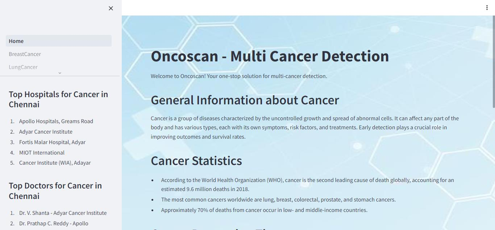
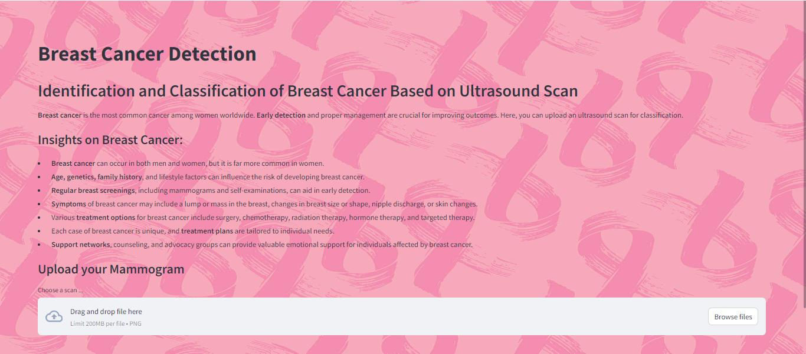
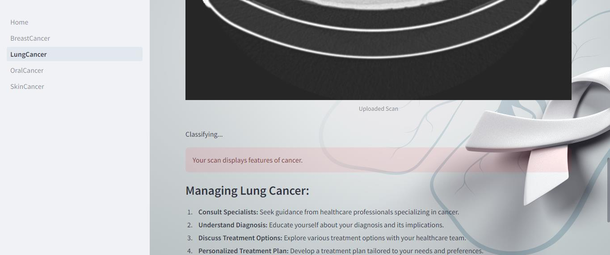
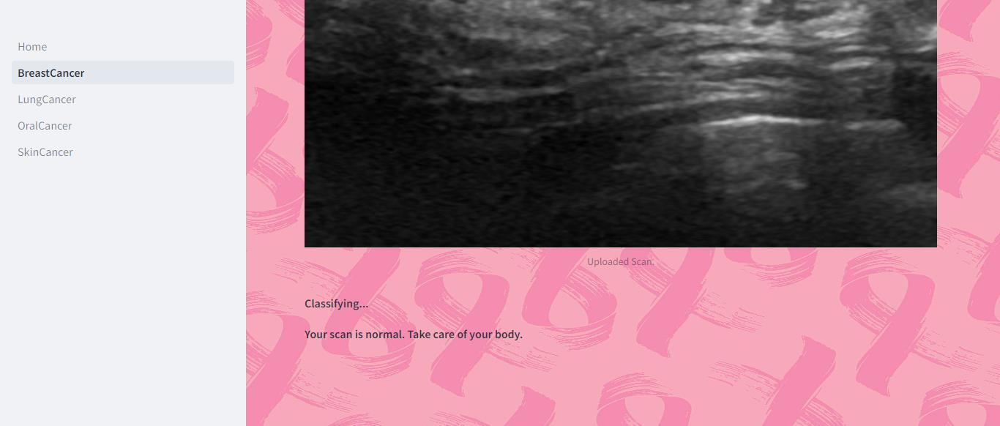

# ONCOSCAN: Multi-Cancer Detection System

## Overview
ONCOSCAN is a state-of-the-art multi-cancer detection system developed to revolutionize cancer diagnostics. Leveraging machine learning (ML) algorithms and advanced data analytics, ONCOSCAN enables simultaneous detection and classification of multiple cancer types, including skin, lung, oral, and breast cancer. The system aims to address the challenges posed by cancer heterogeneity and overlapping symptoms, offering improved accuracy and efficiency in cancer diagnosis.

## Key Features
- **Multi-Cancer Detection:** ONCOSCAN can detect and classify various cancer types using diverse datasets, including clinical parameters, imaging scans, and molecular profiles.
- **Machine Learning Powered:** The system utilizes ML algorithms to analyze complex data patterns indicative of cancerous growths, enabling early detection and precise diagnosis.
- **User-Friendly Interface:** ONCOSCAN provides a user-friendly interface for healthcare professionals to input patient data, view diagnostic results, and generate comprehensive reports.
- **Scalable and Customizable:** The system is scalable to accommodate large datasets and customizable to adapt to evolving cancer research and diagnostic needs.
- **Environmentally Conscious:** ONCOSCAN promotes eco-friendly practices by minimizing resource consumption and utilizing sustainable technologies in its development and operation.
- **Ethical Considerations:** The project upholds ethical standards, including patient privacy, data security, and equitable access to healthcare services, throughout its development and deployment.

## Installation
1. Clone the ONCOSCAN repository to your local machine.
2. Install the required dependencies using `pip install -r requirements.txt`.
3. Run the ONCOSCAN application and follow the on-screen instructions.

## Usage
1. Input patient data, including clinical information and diagnostic tests.
2. Select the desired cancer types for detection (e.g., skin, lung, oral, breast).
3. Click on the "Detect Cancer" button to initiate the multi-cancer detection process.
4. Review the diagnostic results and access detailed reports for further analysis.

## Contributions
Contributions to ONCOSCAN are welcome! If you encounter any issues, have suggestions for improvements, or would like to contribute new features, please feel free to submit a pull request or open an issue on GitHub.

## Acknowledgements
We would like to acknowledge the support and contributions of the entire ONCOSCAN development team and our collaborators in the field of cancer research and diagnostics.

---

**Note:** ONCOSCAN is a project developed for educational and research purposes. It is not intended for clinical use without appropriate validation and regulatory approvals.
                                                                     USE GOOGLE COLAB TO RUN THIS WEB APPLICATION

